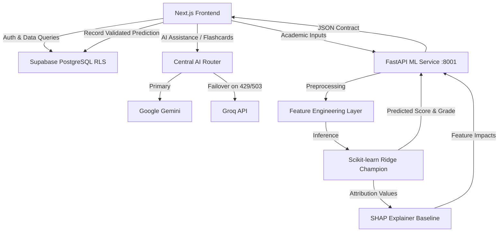

# LearnTrack

### AI-Powered Student Performance Prediction & Analytics

[](https://github.com/MachavaramVenkataram/LearnTrack)
[](https://nextjs.org/)
[](https://fastapi.tiangolo.com/)
[](https://supabase.com/)
[](https://scikit-learn.org/)
[](https://github.com/slundberg/shap)
[](https://deepmind.google/technologies/gemini/)
[](https://groq.com/)

> **Repository URL**: [https://github.com/MachavaramVenkataram/LearnTrack](https://github.com/MachavaramVenkataram/LearnTrack)

---

## Overview

**LearnTrack** is a production-grade full-stack academic intelligence platform designed for students, educators, and academic institutions. Combining **Next.js 16** with Turbopack, **Supabase PostgreSQL** guarded by 100% strict Row Level Security (RLS), a dedicated **FastAPI Machine Learning prediction microservice**, **SHAP** (SHapley Additive exPlanations) for explainable AI, and context-isolated **Google Gemini / Groq fallback** generative intelligence, LearnTrack transforms raw academic signals (attendance, assessments, previous terms, study hours, coursework completion) into transparent, empirical performance predictions and personalized study optimization.

LearnTrack is architected with a strict separation between two distinct intelligence systems:
1. **System A — Generative AI**: Google Gemini primary with automated Groq failover for qualitative assistance (AI Assistant, Flashcards, Study Plans, Practice, Exam Prep, and Knowledge synthesis).
2. **System B — ML Prediction Engine**: FastAPI + Scikit-learn (Ridge Regression champion) + SHAP for quantitative academic scoring, confidence metrics, feature attributions, What-If simulation, model error analysis, and automated retraining.

---

## Features

- **Academic Dashboard**: Centralized command center providing real-time GPA, weighted average score, attendance tracking, and academic health badges.
- **Performance Analytics**: Longitudinal progress visualization, subject breakdowns, semester trend comparisons, and risk indicator alerts.
- **ML Performance Prediction**: Real-time regression inference computing expected final marks, letter grades, and academic risk classifications from student signals.
- **Explainable AI (SHAP)**: Empirical feature attribution cards highlighting exactly how attendance, internal assessments, and study hours mathematically influenced the predicted score.
- **What-If Simulator**: Interactive sensitivity simulator allowing students to hypothetically adjust study hours and attendance to project impact on expected grades before exams.
- **Smart Flashcards**: AI-generated flashcard decks tailored to course syllabi with active recall self-assessment.
- **Spaced Repetition**: Scientific SuperMemo SM-2 algorithmic scheduling ensuring optimal memory retention intervals and mastery tracking.
- **AI Assistant**: Conversational study partner with grounded student context, strict student record isolation, and prompt injection defenses.
- **Study Plan**: Adaptive weekly schedules auto-synthesized from upcoming exams, assignment deadlines, and identified subject weaknesses.
- **Notebook**: Interactive markdown notes editor with rich formatting, subject tagging, and AI summary integration.
- **Knowledge Base**: Curated academic resource repository and study reference documents.
- **Practice**: Subject-specific interactive quizzes and question sets with immediate explanatory feedback.
- **Exam Prep**: Targeted exam readiness diagnostics, high-yield concept reviews, and simulated mock questions.
- **Learning Memory**: Dynamic profile tracking personal study velocity, preferred review times, and recurring conceptual hurdles.
- **AI Insights**: Structured evidence-based observations synthesizing strengths, improvement areas, and priority recommendations.
- **ML Monitoring**: Live telemetry monitoring prediction latency, request volume, and feature distribution shift.
- **Model Evaluation**: Transparent benchmark reports comparing Ridge Regression, Random Forest, Gradient Boosting, and XGBoost across RMSE, MAE, and R² metrics.
- **Model Error Analysis**: Diagnostic residual distributions, quantile error breakdowns, and worst-case scenario analysis.
- **Automated Retraining**: Automated pipeline eligibility checks, validation gates, and admin-guided champion model promotion/rollback.
- **MLflow Experiment Tracking**: Versioned experiment tracking, model parameters, metric logging, and artifact persistence.
- **Reports**: Comprehensive academic summary reports exportable in JSON and CSV formats for student records.

---

## Tech Stack

### Frontend
- **Framework**: Next.js 16 (Turbopack, App Router, React Server Components)
- **Language**: TypeScript 5 (Strict Mode)
- **Styling**: Tailwind CSS 4, Vanilla CSS Design Tokens
- **Icons & Motion**: Lucide React, Framer Motion
- **Visualization**: Recharts, Canvas Confetti

### Backend & ML Microservice
- **Framework**: FastAPI (Asynchronous Python Web Framework)
- **Runtime**: Python 3.13
- **ASGI Server**: Uvicorn
- **Validation**: Pydantic v2
- **Machine Learning**: Scikit-learn (Champion Pipeline), XGBoost, Pandas, NumPy
- **Explainability**: SHAP (TreeSHAP & LinearExplainer)
- **Experiment Tracking**: MLflow Tracking & Registry

### AI Providers (System A)
- **Primary AI**: Google Gemini (`@google/genai`)
- **Fallback AI**: Groq Cloud (`groq-sdk`)
- **Architecture**: Centralized AI Router with automated transient error failover (429 / 503)

### Database & Security
- **Database**: Supabase PostgreSQL 15
- **Authorization**: Row Level Security (RLS) on all tables
- **Authentication**: Supabase Auth (JWT sessions, Password & OAuth support)
- **Storage**: Supabase Storage

### Infrastructure & Deployment
- **Frontend Hosting**: Vercel
- **Containerization**: Docker, Docker Compose
- **CORS & Proxying**: Next.js Proxy Middleware, FastAPI CORS Middleware

---

## Architecture

```text
                           LearnTrack Architecture
                                      │
                   ┌──────────────────┴──────────────────┐
                   ▼                                     ▼
        Next.js 16 (Turbopack)                  Supabase Platform
        ├── App Router                          ├── Auth (JWT & Sessions)
        ├── Server Route Handlers               ├── PostgreSQL 15 (Strict RLS)
        └── Client UI (Recharts / Tailwind)     └── Storage Buckets
                   │
         ┌─────────┴─────────┐
         ▼                   ▼
Central AI Service      FastAPI ML Service (Port 8001)
├── Primary: Gemini     ├── Model: Ridge Regression Champion
└── Fallback: Groq      ├── Explainability: SHAP Feature Impact
                        ├── What-If Simulator Engine
                        ├── MLflow Experiment Tracker
                        └── Drift & Data Quality Checks
```

### Flow Diagram



---

## Getting Started

### Prerequisites
- **Node.js**: v20.x or higher
- **Python**: v3.11 or v3.13
- **Git**
- **Supabase Account** (or local Supabase CLI)
- **Google Gemini API Key** (optional: Groq API Key for fallback)

---

### Installation & Local Setup

#### 1. Clone the Repository
```bash
git clone https://github.com/MachavaramVenkataram/LearnTrack.git
cd LearnTrack
```

#### 2. Environment Configuration
Copy the template configuration files:
```bash
# Root / Frontend
cp frontend/.env.example frontend/.env.local
```

Fill in your configuration variables in `frontend/.env.local`:
```env
# Multi-Provider AI (Server-Side Only)
GEMINI_API_KEY=your_gemini_api_key
GROQ_API_KEY=your_groq_api_key

# Supabase Public Credentials
NEXT_PUBLIC_SUPABASE_URL=https://your-project.supabase.co
NEXT_PUBLIC_SUPABASE_ANON_KEY=your_supabase_anon_key

# ML Microservice URL
NEXT_PUBLIC_ML_API_URL=http://127.0.0.1:8001
```

---

#### 3. Start the FastAPI ML Service (Terminal 1)
```bash
cd ml-service
python -m venv .venv
# Windows:
.\.venv\Scripts\activate
# Linux/macOS:
source .venv/bin/activate

pip install -r requirements.txt
uvicorn app.main:app --host 127.0.0.1 --port 8001 --reload
```
*The ML service will be live at `http://127.0.0.1:8001` (Health check: `http://127.0.0.1:8001/health`).*

---

#### 4. Start the Next.js Frontend (Terminal 2)
```bash
cd frontend
npm install
npm run dev
```
*The web application will be accessible at `http://localhost:3000`.*

---

## Docker Stack (Single Command)

To launch the complete containerized platform:
```bash
docker-compose up --build
```
- Frontend: `http://localhost:3000`
- ML Service: `http://localhost:8001`
- MLflow UI (optional profile): `http://localhost:5000`

---

## Automated Test Suites

LearnTrack features end-to-end unit, integration, and security test coverage:

```bash
# Run all frontend tests (Supabase RLS, Gemini AI, SM-2 Flashcards, ML Client, Test Matrix)
cd frontend
npm test

# Run TypeScript type check
npx tsc --noEmit

# Run ESLint validation
npm run lint

# Run Python ML backend test suite (64 tests)
cd ../ml-service
pytest tests/
```

---

## Security & Responsible AI Use

1. **Zero Secret Leakage**: All server API keys are strictly forbidden from browser bundles and automatically sanitized in telemetry logs.
2. **Multi-Tenant Data Isolation**: Database access is enforced at the database level via PostgreSQL Row Level Security (RLS) policies based on authenticated user JWTs.
3. **Transparent Explainability**: Every ML prediction is delivered with real SHAP attributions rather than black-box scores.
4. **Non-Causal Statistical Communication**: Predictions and What-If simulations are communicated as statistical correlations and decision-support estimates, not determinative institutional grades.

---

## License

This project is licensed under the MIT License - see the LICENSE file for details.
